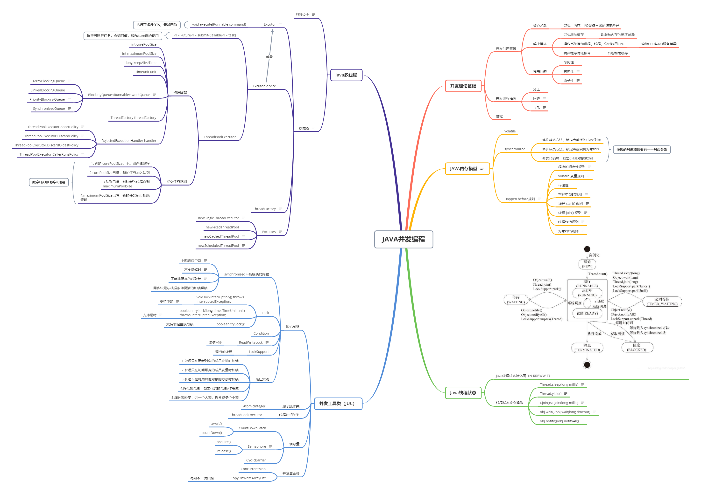

# 作业说明
- Week_04周四(11/05)
  - 作业2：
    - 作业题目：思考有多少种方式，在 main 函数启动一个新线程，运行一个方法，拿到这个方法的返回值后，退出主线程？
    - 作业位置：HomeWork03.java
    - 代码片段：
      1. 主线程执行一个死循环，使用主线程的中断状态作为主线程跳出循环的标识.
          ````java
          private static void method01() {
            long start = System.currentTimeMillis();
            final Thread main = Thread.currentThread();
            Thread task = new Thread(() -> {
                int result = sum();
                System.out.println(Thread.currentThread().getName() + "异步计算结果为：" + result);
                main.interrupt();
            });
            task.start();
            while (true) {
                boolean interrupted = main.isInterrupted();
                if (interrupted) {
                    break;
                }
            }
            System.out.println(Thread.currentThread().getName() + "使用时间：" + (System.currentTimeMillis() - start) + " ms");
          }
          ````
      2. 主线程执行一个死循环，使用局部变量作为标识控制主线程跳出循环。
          ````java
          private static void method02() {
              long start = System.currentTimeMillis();
              final boolean[] endArray = {false};
              Thread task = new Thread(() -> {
                  int result = sum();
                  System.out.println(Thread.currentThread().getName() + "异步计算结果为：" + result);
                  endArray[0] = true;
              });
              task.start();
              while (true) {
                  boolean end = endArray[0];
                  // 这里调用了System.out.println()法，否则循环不会退出。自己猜测调用System.out.println()方法会刷新main线程局部变量的副本，
                  // 程序才会退出，需要继续研究。
                  // TODO ...
                  System.out.println(end);
                  if (end) {
                      break;
                  }
              }
              System.out.println(Thread.currentThread().getName() + "使用时间：" + (System.currentTimeMillis() - start) + " ms");
          }
          ````
      3. 使用volatile关键字修饰的变量作为标识控制主线程退出。
          ````java
          private static void method03() {
            long start = System.currentTimeMillis();
            Flag flag = new Flag();
            Thread task = new Thread(() -> {
                int result = sum();
                System.out.println(Thread.currentThread().getName() + "异步计算结果为：" + result);
                flag.end = true;
            });
            task.start();
            while (true) {
                if (flag.end) {
                    break;
                }
            }
            System.out.println(Thread.currentThread().getName() + "使用时间：" + (System.currentTimeMillis() - start) + " ms");
          }

          class Flag {
              volatile boolean end = false;
          }
          ````
      4. 使用wait()/notifyAll()方法。
          ````java
          private static void method04() {
              long start = System.currentTimeMillis();
              Thread task = new Thread(() -> {
                  int result = sum();
                  System.out.println(Thread.currentThread().getName() + "异步计算结果为：" + result);
                  // 获取管程
                  synchronized (Homework03.class) {
                      Homework03.class.notifyAll();
                      // Homework03.class.notify();
                  }
              });
              task.start();
              // 注意：java.lang.IllegalMonitorStateException
              // 获取管程
              synchronized (Homework03.class) {
                  try {
                      Homework03.class.wait();
                  } catch (InterruptedException e) {
                      e.printStackTrace();
                  }
              }
              System.out.println(Thread.currentThread().getName() + "使用时间：" + (System.currentTimeMillis() - start) + " ms");
          }        
          ````
      5. 调用子线程的join方法，主线程等待子线程执行结束。
          ````java
          private static void method05() {
            long start = System.currentTimeMillis();
            Thread task = new Thread(() -> {
                int result = sum();
                System.out.println(Thread.currentThread().getName() + "异步计算结果为：" + result);
            });
            task.start();
            try {
                task.join();
            } catch (InterruptedException e) {
                e.printStackTrace();
            }
            System.out.println(Thread.currentThread().getName() + "使用时间：" + (System.currentTimeMillis() - start) + " ms");
          }        
          ````
      6. 使用Lock和Condition。
          ````java
          private static void method06() {
            long start = System.currentTimeMillis();
            final Lock lock = new ReentrantLock();
            // 条件变量，子线程已完成工作
            final Condition childIsDone = lock.newCondition();

            Thread task = new Thread(() -> {
                try {
                    lock.lock();
                    int result = sum();
                    System.out.println(Thread.currentThread().getName() + "异步计算结果为：" + result);
                    childIsDone.signalAll();
                    // childIsDone.signal();
                } finally {
                    lock.unlock();
                }
            });
            task.start();

            lock.lock();
            try {
                childIsDone.await();
            } catch (InterruptedException e) {
                e.printStackTrace();
            } finally {
                lock.unlock();
            }
            System.out.println(Thread.currentThread().getName() + "使用时间：" + (System.currentTimeMillis() - start) + " ms");
          }    
          ````
      7. 使用{@link LockSupport#park()}方法和{@link LockSupport#unpark(Thread)}方法。
          ````java
          private static void method07() {
            long start = System.currentTimeMillis();
            Thread main = Thread.currentThread();
            Thread task = new Thread(() -> {
                int result = sum();
                System.out.println(Thread.currentThread().getName() + "异步计算结果为：" + result);
                LockSupport.unpark(main);
            });
            task.start();

            LockSupport.park();
            System.out.println(Thread.currentThread().getName() + "使用时间：" + (System.currentTimeMillis() - start) + " ms");
          }
          ````
      8. 使用{@link CountDownLatch}。
          ````java
          private static void method08() {
            long start = System.currentTimeMillis();
            CountDownLatch downLatch = new CountDownLatch(1);

            Thread task = new Thread(() -> {
                int result = sum();
                System.out.println(Thread.currentThread().getName() + "异步计算结果为：" + result);
                downLatch.countDown();
            });
            task.start();

            try {
                downLatch.await();
            } catch (InterruptedException e) {
                e.printStackTrace();
            }
            System.out.println(Thread.currentThread().getName() + "使用时间：" + (System.currentTimeMillis() - start) + " ms");
          }
          ````
      9. 使用{@link Semaphore}。
          ````java
          private static void method09() {
              long start = System.currentTimeMillis();
              Semaphore semaphore = new Semaphore(2);
              try {
                  // 保证主线程能够被阻塞。
                  semaphore.acquire();
              } catch (InterruptedException e) {
                  e.printStackTrace();
              }
              Thread task = new Thread(() -> {
                  try {
                      int result = sum();
                      System.out.println(Thread.currentThread().getName() + "异步计算结果为：" + result);
                  } catch (Exception e) {
                      e.printStackTrace();
                  } finally {
                      semaphore.release();
                  }
              });
              task.start();
              try {
                  // 保证子线程先执行
                  semaphore.acquire(2);
              } catch (InterruptedException e) {
                  e.printStackTrace();
              }
              System.out.println(Thread.currentThread().getName() + "使用时间：" + (System.currentTimeMillis() - start) + " ms");
          }
          ````
      10. 使用{@link CyclicBarrier}。
          ````java
          private static void method10() {
            long start = System.currentTimeMillis();
            CyclicBarrier barrier = new CyclicBarrier(1);

            Thread task = new Thread(() -> {
                int result = sum();
                System.out.println(Thread.currentThread().getName() + "异步计算结果为：" + result);
                try {
                    barrier.await();
                } catch (InterruptedException | BrokenBarrierException e) {
                    e.printStackTrace();
                }
            });
            task.start();

            try {
                barrier.await();
            } catch (InterruptedException | BrokenBarrierException e) {
                e.printStackTrace();
            }
            System.out.println(Thread.currentThread().getName() + "使用时间：" + (System.currentTimeMillis() - start) + " ms");
          }
          ````

- Week_04周六(10/31)
  - 作业4：
     - 作业题目：把多线程和并发相关知识带你梳理一遍，画一个脑图，截图上传到 Github 上。。
     - 作业位置：JAVA并发编程.jpg
     
---

#学习笔记


