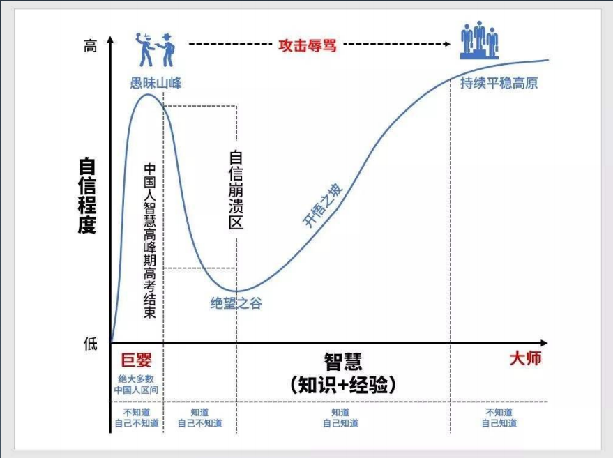

# 毕业项目

分别用 100 个字以上的一段话，加上一幅图（架构图或脑图），总结自己对下列技术的关键点思考和经验认识。

- [x] [JVM](./毕业项目/1.JVM.md)

- [x] [NIO](./毕业项目/2.NIO.md)

- [x] [并发编程](./毕业项目/3.并发编程.md)

- [x] [Spring 和 ORM 等框架](./毕业项目/4.框架.md)

- [x] [MySQL 数据库和 SQL](./毕业项目/5.数据库.md)

- [x] [分库分表](./毕业项目/6.分库分表.md)

- [x] [RPC 和微服务](./毕业项目/7.RPC和微服务.md)

- [x] [分布式缓存](./毕业项目/8.分布式缓存.md)

- [x] [分布式消息队列](./毕业项目/9.分布式消息队列.md)

# 毕业总结

- 最喜欢的一张图

- 最喜欢老师的一句话

  **开放心态**，守正出奇。

- 最喜欢的一节课

  

- 最大的收获

  有了一定的知识体系，有了持续学习的驱动力，一个好老师，一群共同学习的伙伴。

- 最想做的事

  消化课程内容，巩固知识体系，出去闯闯。

- 最遗憾的事

  对自己没有更好积极参与感到不满，总以时间不够为自己找接口，没有积极的交流和沟通。

- 最想说的话

  感谢，加油。

  ......

