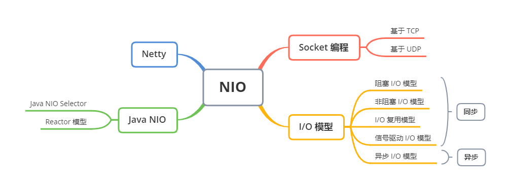

# NIO

[[back]](../README.md)

原始的网络编程思路是，服务端使用一个 While 循环，监听端口是否由新的套接字连接，有则处理。这种方式后面的请求会被前面的阻塞，吞吐量低。后来引进多线程或线程池，也就是很经典的 Connection per thread，每一个连接都用一个线程处理，使得吞吐量显著提高。Connection per thread 的缺点也很明显，线程的频繁创建大量的消耗了系统的资源。进一步改进，采用基于事件驱动的设计，当有事件触发时，才会调用处理器进行数据处理。使用Reactor模式，对线程的数量进行控制，一个线程处理大量的事件。Java 中 New IO（NIO）类库是在 Java 1.4 引入，它在标准 Java 代码中提供了高速的面向块的 IO操作。由于之前 I/O 类库是阻塞 I/O，NIO 类库的目标是要弥补了原来同步阻塞 I/O 的不足，让 Java 可以支持非阻塞 IO，所以更多的人喜欢称 NIO 为非阻塞IO（Non-block I/O）。NIO 弥补了原来同步阻塞 I/O 的不足，它在标准 Java 代码中提供了高速的、面向块的 I/O。

## 知识脑图

