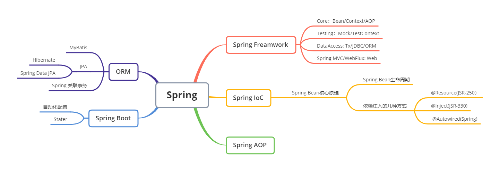

# Spring 和 ORM 等框架

[[back]](../README.md)

Spring 是一个优秀的 Java 框架，其目的是用于简化企业级应用程序开发。面向对象编程以类和对象作为组织代码的基本单位，在进行面向对象编程时，我们关心如何使这些对象协作来完成所需功能，而且要低耦合、高内聚。Spring 框架能够帮助我们创建对象及管理这些对象之间的依赖关系，简化开发工作。Spring框架的核心特性是 IoC 容器 AOP，引入Spring意味着引入了一种研发协作模式。

## 知识脑图

