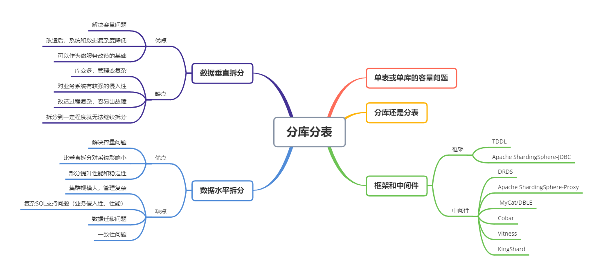

# 分库分表

[back](../README.md)

单表的数据量过大，会导致对单表的读写操作性能降低，进而影响了系统的性能和稳定性。数据库主从复制，读写分离只能分担了单个数据库的访问压力，但单个数据库的容量不变，单机性能无法解决。一个好的解决容量的办法对单表进行垂直或水平拆分，降低单表的数据量。对表的拆分会影响到源系统，垂直拆分对业务侵入强，改造过程复杂，容易出现故障；水平拆分会引入一些中间件或中间层使得表的拆分做到透明，对业务影响较小，但会有复杂 SQL 支持问题，数据迁移问题，一致性问题。

## 知识脑图

